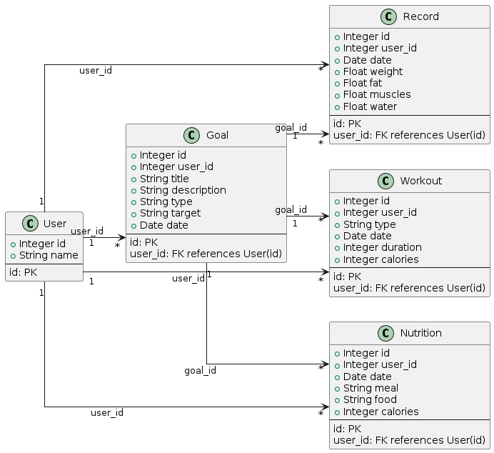

# Personal Fitness Tracker

# Context:

**Web Application:** We are creating a **Personal Fitness Tracker**.

**Purpose:** The goal is to help users track their fitness journey,
manage workout routines, monitor nutrition, and set and achieve fitness
goals.

**Theme:** The application focuses on holistic personal fitness
management, providing an intuitive interface for recording and analyzing
fitness-related data.

# Frames:

{width="7.839583333333334in"
height="3.6798611111111112in"}{width="0.976923665791776in"
height="1.3333333333333333in"}Index(Home) Page

{width="1.2154363517060367in"
height="1.8119422572178479in"}{width="1.9836329833770778in"
height="0.660819116360455in"}{width="1.410211067366579in"
height="2.0959798775153105in"}{width="7.774305555555555in"
height="3.7263888888888888in"}Workout Page

Nutrition Page:

{width="7.821527777777778in"
height="3.71875in"}With the same functionalities as in workout page
(explained in workout wireframe).

Records page:

{width="7.8125in"
height="3.685416666666667in"}With the same functionalities as in workout
page (explained in workout wireframe).

{width="1.2656660104986877in"
height="1.2586996937882764in"}{width="1.3078094925634296in"
height="1.2982458442694662in"}{width="7.590277777777778in"
height="3.5972222222222223in"}Goals Page:

# UML diagrams:

Class diagram

{width="5.6565660542432195in"
height="5.18246062992126in"}

Sequence diagrams

### Functionality 1: Add New Record

#### Sequence Diagram for Adding a New Record

{width="6.268055555555556in"
height="2.359027777777778in"}

### Functionality 2: Fetch Overview Data

#### Sequence Diagram for Fetching Overview Data

{width="6.268055555555556in"
height="3.073611111111111in"}

### Functionality 3: Fetch and Display Progress for Goals

#### Sequence Diagram for Fetching and Displaying Goal Progress

{width="6.268055555555556in"
height="2.3097222222222222in"}

Use-case diagram

{width="4.401192038495188in"
height="8.542397200349956in"}